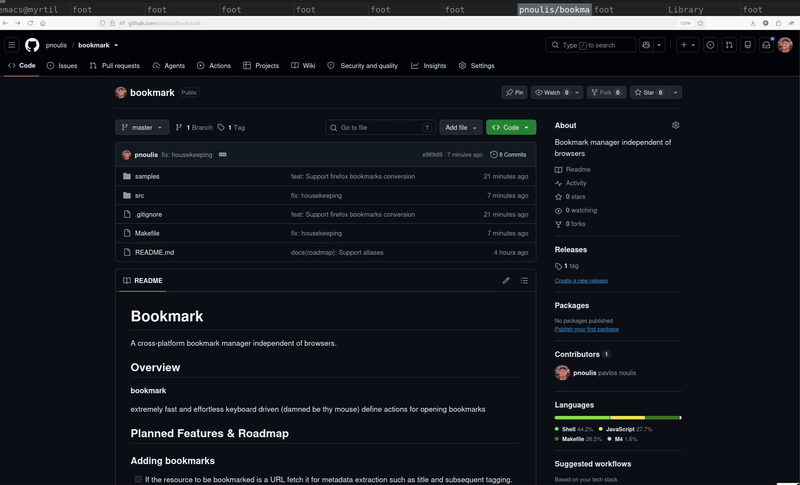

# Bookmark

A fast and effortless keyboard driven (damned be thy mouse) bookmark manager
independent of browsers.



## Planned Features & Roadmap

### Adding bookmarks

- [X] Add boomarks
- [ ] If the resource to be bookmarked is a URL fetch it for metadata extraction
      such as title and subsequent tagging. Such an action also serves as an
      existence verification.
- [ ] Support an optional alias for the bookmark

### Searching bookmarks

- [X] Fuzzy search

### Opening bookmarks

- [ ] Open bookmarks without the need to copy them to the url address bar

### Editing bookmarks

- [ ] Allow the user to add/edit

## Getting Started

### Installation

```sh
    make
    sudo ./install.system
```
